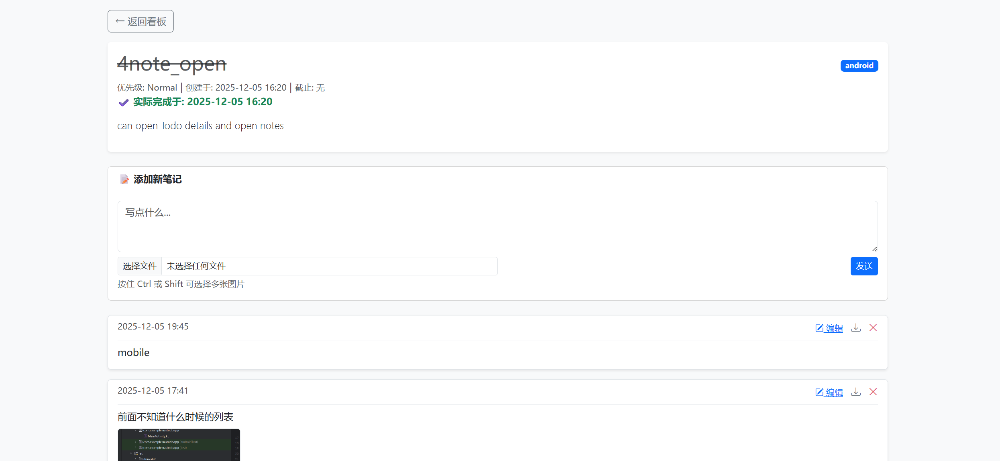

# 📝 NAS To-Do (Private Cloud Task Manager)

**NAS To-Do** 是一款专为 NAS 用户和隐私爱好者打造的**全栈式、自托管**待办事项管理系统。

不同于普通的 To-Do 软件，它采用了 **“项目日志”** 的设计理念，支持在任务执行过程中记录富文本笔记和快照。配合原生 Android 客户端，借助底层的 **UUID 离线架构**，它能实现完美的多端离线操作与双向无冲突同步。

### **Tips：nas-todo所有代码均使用Gemini AI完成。**

---

## ✨ 核心特性 (Features)

### 🔄 离线优先与极致同步
- **UUID 架构**：底层数据库重构为 UUID 主键，支持移动端离线创建任务，联网后无冲突自动合并。
- **Zero-Latency Sync**：列表页采用 **Base64 缩略图内嵌**技术，移动端浏览“秒开”，彻底解决弱网下的图片加载裂图问题。
- **增量更新**：API 设计支持全字段的增量修改与时间戳校验。

### 📝 沉浸式记录
- **富媒体笔记**：每个任务下可添加多条笔记，支持 `multipart/form-data` 多图上传。
- **自动化处理**：后端集成 `Pillow` 库，上传图片自动生成缩略图，节省带宽。
- **全格式导出**：支持将任务及其所有笔记、图片自动排版并导出为 **Word (.docx)** 文档，实现真正的离线备份与分享。

### ⚡ 生产级后端
- **高并发支持**：内置 **Waitress** 生产级 WSGI 服务器，配置 32 线程并发与超长连接超时，无惧移动端批量请求。
- **归档系统**：提供“归档箱”机制，将完成的任务移出视线但永久保存。
- **RESTful API**：提供完善的接口支持，方便对接其他智能家居系统。

---

## 🛠️ 项目结构 (Project Structure)

本项目采用 Monorepo 模式，同时包含服务端与客户端代码：

```text
nas-todo/
├── server/             # Python Flask 后端与 Docker 配置
│   ├── app.py          # 核心业务逻辑
│   ├── data/           # (自动生成) 数据库与图片存储
│   └── ...
├── android/            # Android 客户端源码 (Kotlin/Jetpack)
├── README.md           # 项目文档
└── LICENSE             # 开源协议
````

-----

## 🚀 服务端部署 (Server Deployment)

### 1\. 获取代码

```bash
git clone [https://github.com/wszd158/nas-todo.git](https://github.com/wszd158/nas-todo.git)
cd nas-todo/server
```

### 2\. 启动服务

本项目完全容器化，确保你的机器已安装 Docker。

```bash
# 构建并后台启动
docker-compose up -d --build
```

启动成功后，访问 `http://NAS_IP:5000` 即可使用 Web 版。

### 3\. 数据持久化

`docker-compose.yml` 默认将数据挂载在当前目录的 `data` 文件夹下：

  - `server/data/todo.db`: SQLite 数据库文件
  - `server/data/uploads/`: 图片附件
  
### 4\. 注册

要先输入用户名密码，再点击"注册"才能注册新用户；

-----

## 📱 Android 客户端 (Android Client)

Android 客户端源码位于 `android/` 目录下，采用 **Kotlin + MVVM + Room** 架构开发。

### ✨ 客户端亮点

  * **📡 离线优先 (Offline-First)**：基于本地数据库运行，断网环境下依然可以创建任务、编辑笔记，联网后自动推送同步。
  * **🌙 深色模式 (Dark Mode)**：完美适配 Android 系统深色主题，采用沉浸式设计，护眼舒适。
  * **🎨 现代化 UI**：全新的 Material Blue 视觉风格，支持实时排序、历史登录记录快捷切换。
  * **📄 文档导出**：手机端直接生成并下载任务的 Word 报表。

### 📥 下载与使用

1.  前往本项目的 **[ https://github.com/wszd158/nas-todo/tags ]** 下载最新版 `.apk` 安装包。
2.  安装后打开 App，输入你的自托管服务器地址进行登录。
      * *示例地址：`http://192.168.1.5:5000` 或 `https://todo.yourdomain.com`*

### 🔨 源码编译

如果你想自己编译或修改客户端：

1.  使用 **Android Studio** 打开 `android/` 目录。
2.  等待 Gradle Sync 完成。
3.  连接设备并点击 Run。

-----

## 🔌 API 文档

后端提供标准的 RESTful API，支持 Basic Auth 认证，详细请查看server/app.py。

| 方法 | 路径 | 说明 |
| :--- | :--- | :--- |
| `GET` | `/api/tasks` | 获取任务列表（支持 `show_archived`, `sort_by`, `q` 等筛选） |
| `POST` | `/api/tasks` | 创建任务（支持传入 UUID 实现离线创建） |
| `PUT` | `/api/tasks/<uuid>` | 修改任务（全字段更新，包括归档状态、时间等） |
| `POST` | `/api/notes` | 添加笔记（支持图片上传与 Base64 缩略图返回） |

-----

## 📄 License

本项目基于 [MIT License](https://www.google.com/search?q=LICENSE) 开源。

## 📸 预览 (Screenshots)



更多截图可见./assets路径

